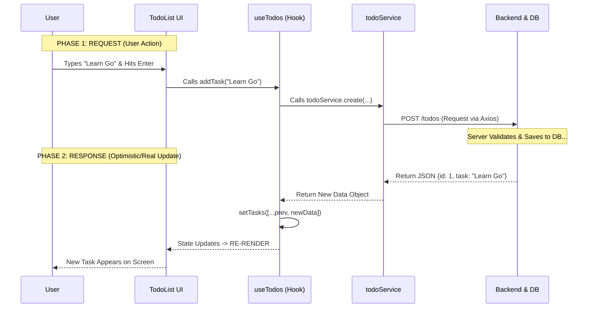
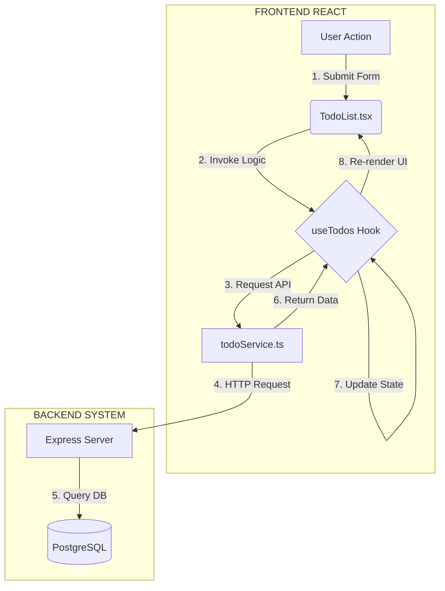

# Fullstack Productivity Hub


**Fullstack Productivity Hub** is a comprehensive web application designed to streamline daily tasks and boost efficiency. Built using the **PERN Stack** (PostgreSQL, Express, React, Node.js), this application integrates task management, note-taking, code snippet storage, and productivity analytics into a single, cohesive interface.


## System Design & Architecture

> *"I believe that writing code is the last step of engineering. Before typing a single line of code, I mapped out the entire system architecture to ensure scalability and efficiency."*

Below is the blueprint of the application's data flow, including Authentication logic, MVC structure, and Database relationships.

### Architectural Blueprint


<details>
<summary><b>Click to view Database Schema Relationship</b></summary>
<br>

</details>


## Data Flow & Logic

To ensure data integrity and predictable state management, this project follows a strict **Unidirectional Data Flow**.

### 1. Request-Response Cycle (Sequence Diagram)
This diagram illustrates the "Round Trip" of data when a user adds a new task.



### 2. Architectural Layers (Flowchart)

How the Frontend (React) communicates with the Backend (Express/Postgres).



---

##  Key Features

###  Authentication & Security

* **Secure Registration & Login:** Password hashing using `bcryptjs`.
* **JWT Authorization:** Protected routes using Middleware to verify `access_tokens`.
* **Session Management:** Auto-attach tokens via Axios Interceptors for seamless UX.

###  Task & Data Management

* **Kanban/ToDo List:** Drag and drop functionality using `@dnd-kit`.
* **Snippet Library:** Store and retrieve code snippets with syntax highlighting.
* **Note Pad:** Rich text notes for quick ideas.
* **CRUD Operations:** Full Create, Read, Update, Delete capabilities across all features.

###  Productivity Tools

* **Pomodoro Timer:** Integrated focus timer.
* **Analytics Dashboard:** Visual productivity charts using `recharts` and `date-fns`.

###  UI/UX

* **Modern Design:** Built with **Tailwind CSS**.
* **Interactive Animations:** Smooth transitions using **GSAP**.
* **Responsive Layout:** Fully functional on desktop and mobile devices.

---

##  Tech Stack

| Area | Technologies |
| --- | --- |
| **Frontend** | React.js (Vite), Tailwind CSS, React Context API, GSAP, Recharts |
| **Backend** | Node.js, Express.js |
| **Database** | PostgreSQL, Sequelize ORM |
| **Security** | JWT (JSON Web Token), Bcryptjs |
| **Utilities** | Axios (Interceptors), date-fns, @dnd-kit |

---

##  MVC Implementation

This project follows the **MVC (Model-View-Controller)** pattern to ensure code maintainability and separation of concerns.

1. **Middleware (The Gatekeeper):** Validates the `Authorization: Bearer <token>` header. If invalid, the request is rejected immediately.
2. **Controller (The Manager):** Processes the business logic. It extracts the `userId` from the decoded token (preventing identity spoofing) and validates input.
3. **Model (The Blueprint):** Sequelize defines the schema (e.g., `DataTypes.TEXT`) and ensures data integrity.

> **Security Highlight:** User IDs are never taken from the request body manually. They are extracted strictly from the validated JWT token (`req.user.userId`).

---

##  Project Structure

```bash
project-todolist/
├── backend/                # Server-side logic
│   ├── config/             # Database connection (Sequelize)
│   ├── controllers/        # Business logic (ToDo, Notes, Auth)
│   ├── middleware/         # Auth verification (JWT)
│   ├── models/             # Database schemas
│   ├── routes/             # API Endpoints
│   └── server.js           # Entry point
│
├── frontend/               # Client-side application
│   ├── src/
│   │   ├── components/     # Reusable UI components
│   │   ├── context/        # Global state management
│   │   ├── hooks/          # Custom hooks (useFetch, useTodos)
│   │   ├── pages/          # Full page views
│   │   ├── services/       # API integration logic
│   │   └── types/          # TypeScript Interfaces
│   └── vite.config.js
└── README.md

```